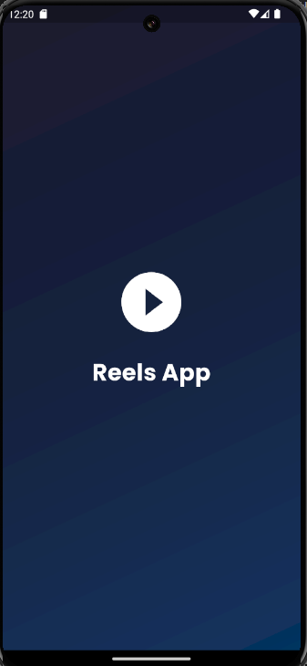

# Reels App

A modern Flutter application for watching short videos with a TikTok-like interface.

## Features

- 🎥 **Video Feed**: Infinite scroll through videos
- 🎨 **Modern UI**: Glassmorphism design with gradient themes
- 📱 **Full Screen Videos**: Immersive viewing experience
- ❤️ **Interactive Elements**: Like, comment, and share functionality
- 🔊 **Audio Support**: Volume control with mute/unmute
- 🎯 **Category Selection**: Choose your preferred content categories
- 🔄 **Fresh Content**: New videos on every refresh

## 📸 Screenshots

| Splash Screen | Categories Page | Video Feed |
|---------------|------------------|-------------|
|  |  |  |

## Setup Instructions

### 1. Clone the Repository
```bash
git clone <your-repo-url>
cd reels_app
```

### 2. Install Dependencies
```bash
flutter pub get
```

### 3. Setup Environment Variables
1. Copy the example environment file:
   ```bash
   cp .env.example .env
   ```

2. Get your Pexels API key:
   - Visit [Pexels API](https://www.pexels.com/api/)
   - Sign up for a free account
   - Generate your API key

3. Update the `.env` file:
   ```
   PEXELS_API_KEY=your_actual_api_key_here
   ```

### 4. Run the App
```bash
flutter run
```

## Project Structure

```
lib/
├── core/
│   ├── constants/
│   ├── di/
│   └── network/
├── data/
│   ├── datasources/
│   ├── models/
│   └── repositories/
├── domain/
│   ├── entities/
│   ├── repositories/
│   └── usecases/
└── presentation/
    ├── pages/
    ├── providers/
    └── widgets/
```

## Environment Variables

The app uses environment variables to keep sensitive information secure:

- `PEXELS_API_KEY`: Your Pexels API key for fetching videos

**Note**: Never commit your `.env` file to version control. It's already added to `.gitignore`.

## Contributing

1. Fork the repository
2. Create your feature branch (`git checkout -b feature/amazing-feature`)
3. Commit your changes (`git commit -m 'Add some amazing feature'`)
4. Push to the branch (`git push origin feature/amazing-feature`)
5. Open a Pull Request

## License

This project is licensed under the MIT License.